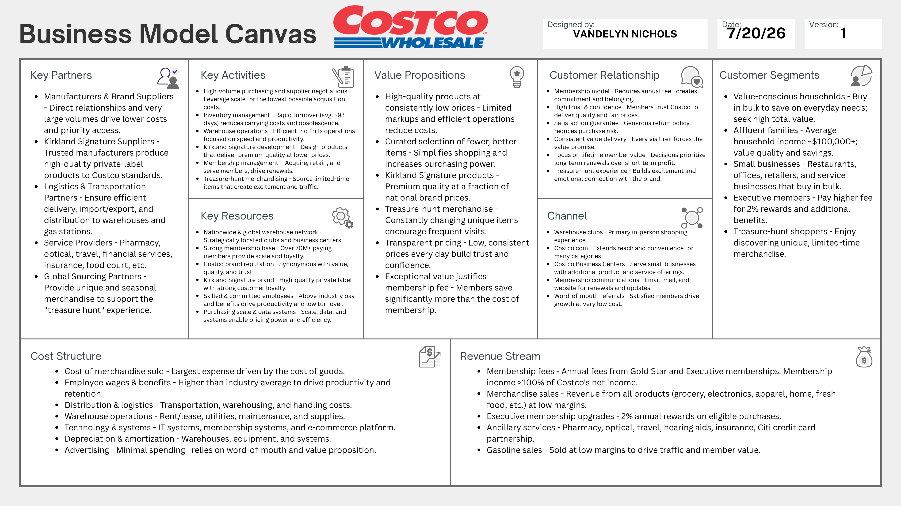

Costco’s success cannot be explained by low prices alone. Its competitive advantage stems from how its value proposition, target customers, and cost leadership strategy work together to reinforce a single business model. Understanding how these strategic choices create lasting competitive advantage helps explain why Costco has remained one of the world’s most successful retailers [@thompson2020; @porter1985].

## Costco’s Value Proposition

The starting point for understanding Costco’s strategy is its value proposition. At first glance, Costco’s value proposition appears to be high-quality products at consistently low prices. Although low prices are central to its success, they do not fully explain why millions of customers willingly pay an annual membership fee before making a purchase. Members are paying for confidence, not just lower prices.

Costco has already done the work of selecting quality products and negotiating competitive prices, so members do not have to wonder whether they found the best deal. Instead, they can purchase with confidence rather than spending time comparing products or searching for better prices. Costco does more than save customers money; it removes the time, effort, and uncertainty that usually come with deciding where to shop and what to buy. Eliminating that uncertainty is not simply a benefit of Costco’s business model—it is the core of its value proposition [@thompson2020; @signals2024]. The membership fee supports that value, and the value, in turn, justifies the fee.

Costco delivers on its value promise through a set of deliberate decisions. Limiting the product assortment to about 3,700 active SKUs increases purchasing leverage and streamlines operations. Strict markup limits build trust that prices remain competitive. The Kirkland Signature brand offers shoppers national-brand quality at a lower price, and the generous return policy reduces purchasing risk. Together, these decisions create a shopping experience that members trust and are willing to pay to access, demonstrating how multiple strategic choices reinforce a single value proposition [@thompson2020].

Unlike most retailers, Costco generates a significant portion of its operating income from membership fees rather than merchandise sales. This approach is more than a revenue model—it is what makes the entire system work. Membership fees make it possible to maintain low markups, which define the customer experience. Consistently delivering on that experience drives membership renewals, creating a self-reinforcing cycle [@thompson2020; @troy2021]. Competitors may match individual prices, but replicating the membership-driven model that sustains those prices is far more difficult [@thompson2020].

## Costco’s Target Customers

The success of Costco’s membership model depends on attracting customers who consistently recognize and receive value from it. Customer selection becomes a strategic decision rather than simply a marketing decision. Costco’s primary customer segments include families, higher-income households, small business owners, and Executive Members. Although these groups vary demographically, they share purchasing habits that align closely with Costco’s business model, including buying in larger quantities, planning shopping trips, valuing consistent pricing over promotions, and viewing the membership fee as an investment that delivers savings over time [@thompson2020].

These purchasing behaviors strengthen the business model in meaningful ways. Larger basket sizes increase inventory turnover, while higher-income households and small business owners provide consistent purchasing activity throughout the year. Executive Members further strengthen the model by paying a higher membership fee in exchange for additional benefits, demonstrating that Costco’s value proposition extends beyond low prices.

Customers who consistently recognize that value are more likely to renew, creating a stable source of recurring revenue that supports Costco’s low-markup strategy. Rather than trying to attract every shopper, Costco focuses on customers whose purchasing behaviors naturally reinforce its strategy [@thompson2020].

The strategic importance of customer selection becomes even more apparent when considering potential shifts in the membership base. If lower-income, more price-sensitive shoppers made up a larger share of the membership, renewal rates would become less predictable, weakening the fee revenue that supports the low-price model.

The entire business model depends on retaining customers who renew reliably because they consistently receive value that justifies the cost. That is not simply a demographic preference—it is a strategic requirement. Costco built a strategy that works because the customers it targets naturally sustain it [@thompson2020; @porter1985].

## Costco’s Cost Leadership Strategy

Costco’s competitive approach aligns most closely with Porter’s broad cost leadership strategy. The company serves a wide market while consistently offering lower prices than traditional retailers, achieving this not by sacrificing quality but through a system of operating decisions that reduce costs at every level of the business [@porter1985].

Limited product variety concentrates purchasing power, allowing Costco to negotiate lower prices from suppliers. Simple warehouse layouts, pallet merchandising, and minimal advertising reduce operating costs, while disciplined merchandise markups ensure those savings are passed on to members. The resulting value encourages membership renewals, generating recurring fee revenue that sustains the low-price strategy. Together, these decisions create a cost advantage that competitors struggle to replicate [@thompson2020; @cuofano2018; @porter1985].

Some aspects of Costco’s business, including Kirkland Signature, the treasure-hunt shopping experience, and its generous return policy, may initially appear to be differentiators. In reality, these features strengthen Costco’s cost leadership strategy rather than replace it. Kirkland Signature enhances value and improves margins, the treasure-hunt experience encourages repeat visits without significant advertising costs, and the return policy builds member trust and supports renewals. These elements add to membership value and reinforce the same system that makes the low-price strategy sustainable [@thompson2020; @porter1985].

## Sustaining Costco’s Competitive Advantage

What makes Costco’s competitive advantage durable is not any single decision but the way every major strategic choice reinforces the next. The membership model funds the value proposition; the value proposition builds customer loyalty; loyal members renew; and those renewals provide the financial foundation that allows Costco to sustain its low-price strategy.

Competitors can copy individual tactics, but replicating a fully integrated strategy in which every element strengthens the others is far more difficult. That interdependence, more than any individual decision, is what has allowed Costco to sustain its competitive advantage while others with similar ambitions have not [@thompson2020; @porter1985].

## Appendix A

### Business Model Canvas: Costco Wholesale

{fig-alt="Costco Wholesale Business Model Canvas"}

## References

::: {#refs}
:::
