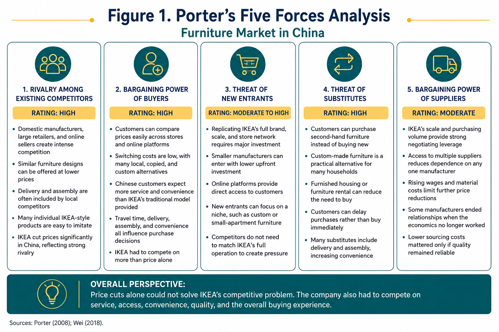
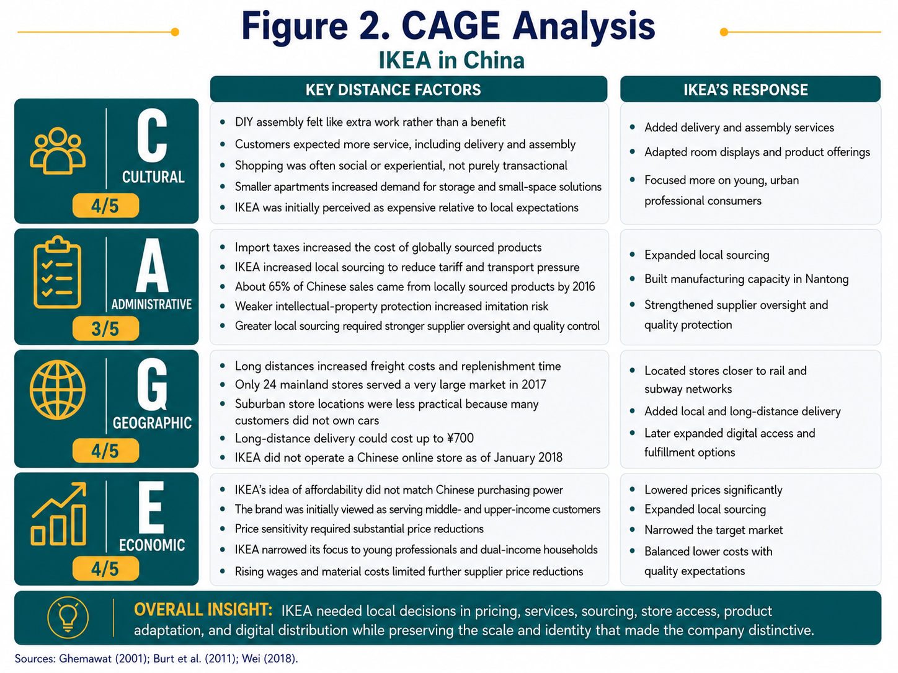
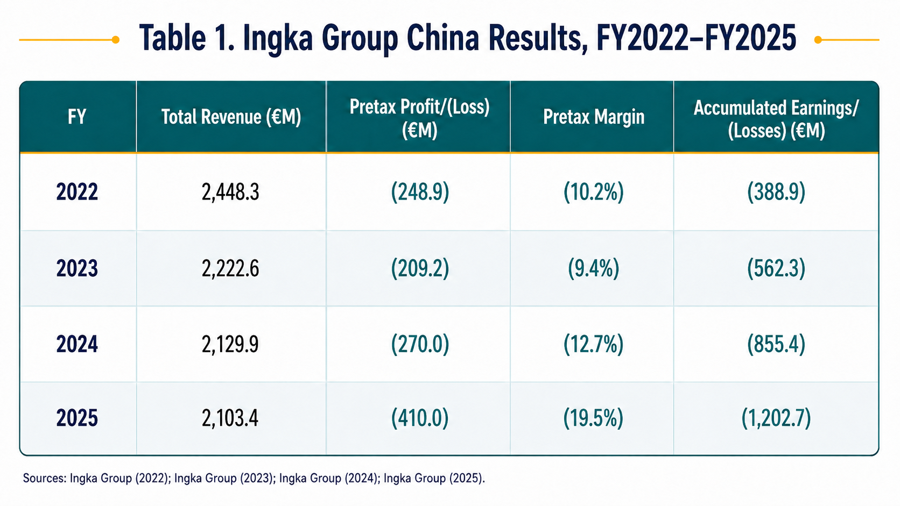

Global expansion often looks most attractive from a distance. China offered IKEA a rapidly growing furniture market, rising incomes, an expanding middle class, and a powerful manufacturing base. These conditions made entry seem logical, but they did not make success automatic. IKEA entered with a standardized global model built around consistent products, large destination stores, customers transporting their own purchases, and do-it-yourself assembly. Chinese customers valued parts of IKEA’s system—especially the brand, modern design, and store experience—but they did not value every part to the same extent as European consumers (Wei 2018).

## The Strategic Challenge

IKEA’s global strategy did not fully align with what Chinese customers valued. Its combination of affordable design, limited services, and do-it-yourself assembly worked in many Western markets, but Chinese customers placed greater value on lower prices, convenient access, delivery and assembly, and products suited to smaller homes. IKEA could not assume that customers everywhere wanted the same thing; parts of its original offering were less relevant in China (Wei 2018).

This disconnect weakened IKEA’s low-price positioning. Products considered affordable in many Western markets were viewed as expensive by much of IKEA’s original target market in China. Customers willing to pay more questioned whether the quality, service, and convenience justified the cost, while price-conscious customers could find similar-looking products from local sellers for less. The result was a poor fit with the market: IKEA’s prices exceeded what many customers could afford, while its original service and shopping model did not offer the value higher-income customers expected (Wei 2018).

The leadership challenge was deciding which parts of the model still created value and which had become limitations in China. IKEA needed to protect what competitors could not easily copy while changing the customer-facing parts that did not fit the market (Brandenburger 2019; Wei 2018).

## Competitive Pressure in China: Porter’s Five Forces

Porter’s Five Forces helps explain the competitive pressures IKEA faced in China. Rivalry, buyer power, and the threat of substitutes were high; new-entry pressure was moderate to high; and supplier power was moderate. The problem was not a single force, but the combined pressure they created (Porter 2008; Wei 2018).

*Figure 1. Porter’s Five Forces analysis of IKEA in China.*

### Rivalry — High

IKEA competed with domestic manufacturers, large furniture retailers, international brands, custom-furniture companies, and online sellers. Competition extended beyond the furniture itself. Local businesses could offer similar designs at lower prices, include delivery and assembly, or serve customers in cities where IKEA did not have a store. While IKEA’s brand was difficult to replicate, many of its individual products were not. Between 2000 and 2018, IKEA reduced its prices in China by approximately 60 percent. Lower prices attracted more customers, but they also reflected how competitive the market had become. For IKEA, intense rivalry meant brand recognition alone was not enough (Wei 2018).

### Buyer Power — High

Customers could compare prices online, buy from local retailers, choose an imitation, request custom-made furniture, or postpone the purchase altogether. Chinese customers expected more service and convenience than IKEA’s traditional model provided. Many consumers did not own cars, had little interest in transporting flat-packed furniture, and could arrange affordable delivery and assembly through local retailers. To remain competitive, IKEA lowered prices, improved store accessibility, expanded services, and shifted its focus toward younger, middle-class consumers. Customers were evaluating far more than the price on the shelf. Travel time, delivery, assembly, convenience, and the overall shopping experience all influenced their choice of where to buy (Wei 2018).

### Threat of New Entrants — Moderate to High

Building another company with IKEA’s brand, supplier network, and large-store experience required significant investment. Entering the market on a smaller scale was much easier. Local manufacturers could begin selling furniture with relatively low upfront investment, especially as online platforms gave them direct access to customers. Many could focus on a single product category, custom furniture, or solutions for small apartments without carrying the cost of IKEA’s full retail model. New entrants did not need to replace IKEA across the entire market to be successful. A smaller business could create pressure in a promising niche without matching the scale of IKEA’s full operation (Wei 2018).

### Threat of Substitutes — High

Customers did not have to buy new, standardized furniture from IKEA to meet their needs. They could purchase second-hand furniture, commission custom pieces, rent furniture, or delay the purchase altogether. Custom furniture was an attractive alternative because affordable labor and local manufacturing allowed customers to create pieces designed specifically for their homes, often with delivery and assembly included. IKEA was competing against more than other furniture retailers. Customers had several practical ways to furnish their homes, each with different advantages (Wei 2018).

### Supplier Power — Moderate

IKEA’s scale, purchasing volume, and access to a large Chinese manufacturing network gave it substantial negotiating leverage. Suppliers benefited from large orders and access to IKEA’s global system, while IKEA could shift production across multiple manufacturers. That influence still had limits. Wages and material costs were rising, and suppliers could not continue accepting price reductions without eroding their own margins. In 2011, 12 original manufacturers ended their relationships with IKEA, showing that some suppliers were willing to walk away when the economics no longer made sense. The challenge was balancing cost with quality. Lower costs meant nothing if product quality suffered or customers lost confidence in the brand. IKEA needed suppliers that could support both competitive costs and consistent quality over the long term (Wei 2018).

Porter’s Five Forces shows why price cuts alone could not solve IKEA’s competitive problem. IKEA had to deliver value across the entire purchase experience—not just on the price tag (Porter 2008; Wei 2018).

## Why the Original Model Traveled Poorly: CAGE Analysis

China offered significant opportunities, but IKEA could not assume its European model would work unchanged. Cultural, administrative, geographic, and economic differences affected customer expectations, operating costs, and daily decisions. CAGE helped clarify where standardization still created value and where local decisions were necessary (Ghemawat 2001).

*Figure 2. CAGE analysis of IKEA’s expansion into China.*

### Cultural Distance — 4/5

IKEA’s low-price model assumed customers would transport and assemble their own furniture in exchange for lower prices. In China, affordable labor made professional delivery and assembly widely available, so DIY often felt like extra work rather than a benefit. Shopping habits were also different. Some visitors used the showrooms for design ideas, rested in display rooms, or visited the restaurant without making a purchase. Smaller apartments and different room layouts increased demand for storage, balcony furniture, hallway solutions, and displays that reflected how Chinese customers actually lived. IKEA responded by adding fee-based delivery and assembly, adjusting room displays and product offerings, and focusing more closely on young, educated, white-collar consumers drawn to modern Western design. The challenge was turning interest in the brand into profitable purchases (Burt, Johansson, and Thelander 2011; Wei 2018).

### Administrative Distance — 3/5

Import taxes made globally sourced products less affordable, prompting IKEA to increase local sourcing and build a manufacturing facility in Nantong, near its two Shanghai warehouses. By December 2016, approximately 65 percent of IKEA’s Chinese sales came from locally sourced products. This reduced exposure to tariffs and transportation costs, but it placed greater pressure on supplier oversight and quality control (Wei 2018).

Weaker intellectual-property protection created another challenge. Product designs, assembly instructions, online keywords, and even parts of IKEA’s retail format could be copied more easily. Local sourcing helped IKEA lower costs, but it also increased the importance of protecting product quality and the brand reputation that distinguished IKEA from local competitors (Wei 2018).

### Geographic Distance — 4/5

The distance between Europe and China increased freight costs and replenishment times, while the difficulty of reaching customers within China created additional complexity. Only 24 mainland stores in 2017 served a very large market, and IKEA’s traditional suburban locations were less practical because many customers did not own cars (Wei 2018).

The company moved stores closer to rail and subway networks and added local and long-distance delivery, but fees for distant delivery could reach ¥700. Outsourced fulfillment also created problems with lost merchandise, inventory availability, and assembly. As of January 2018, IKEA still did not operate an online store in China. For customers outside its store markets, buying from a more accessible online seller was often the easier choice (Wei 2018).

### Economic Distance — 4/5

IKEA’s European definition of affordability did not match Chinese purchasing power. The company initially targeted low- to middle-income consumers, but a 2009 survey found that customers viewed the brand as serving the middle and upper classes. IKEA eventually focused more narrowly on young professionals and dual-income households while lowering prices and expanding local sourcing (Wei 2018).

China’s manufacturing network also enabled IKEA to reduce costs across its global operations. That advantage had limits. Rising wages and material costs made continued supplier price reductions less sustainable and increased the risk that lower prices would come at the expense of quality (Wei 2018).

The CAGE scores show that the problem was not a lack of opportunity, but the gap between IKEA’s European model and what Chinese customers expected from the buying experience. Pricing, services, sourcing, store access, product adaptation, and digital distribution required local decisions. A transnational strategy was the more practical approach. IKEA could keep the global efficiencies and brand consistency that made the business work while changing the parts of the model that influenced whether Chinese customers saw enough value to buy. It did not need a completely different model for China, but it did need a more locally responsive version of the one it already had (Ghemawat 2001; Burt, Johansson, and Thelander 2011; Wei 2018).

## Why IKEA Entered China—and Whether It Was the Right Decision

Entering China fit IKEA’s global strategy because the market offered both customer growth and manufacturing scale. China’s cities were expanding, more households were purchasing homes, incomes were rising, and consumers were becoming more interested in furnishing and decorating those homes. From 2004 through 2011, furniture-industry sales grew by an average of 31 percent annually (Wei 2018).

China also became increasingly important to IKEA’s global supply network. By FY2016, approximately 26 percent of IKEA’s global purchasing came from China. This allowed the company to increase sales in a growing market while using Chinese production to support its operations worldwide (Wei 2018).

Entering China was the right strategic decision, but IKEA initially underestimated how much of its model would need to change. The company remained unprofitable in China for the first decade and operated only four stores during that period. Its original target customer could not comfortably afford the products, its low-price positioning was difficult to defend against local competitors, and its self-service model placed work on customers who did not view that tradeoff as valuable. IKEA recorded its first profit in China in 2008 after beginning to adjust its strategy to better reflect market conditions and customer expectations (Wei 2018).

By FY2017, China sales had reached ¥13.2 billion, increasing 14 percent from the prior year, while store visits rose 11 percent to 90 million. China also grew from no more than 1 percent of IKEA’s global sales in FY2005 to almost 3 percent by FY2017. These results support the decision to enter China, but they also show that the opportunity became more valuable only after IKEA developed a better fit with the market (Wei 2018).

## What the Recent Financial Results Add

The more recent financial results keep the case from ending with IKEA’s 2017 turnaround. The original case does not provide China-specific margins, cash flow, return on equity, or store-level returns, and IKEA’s consolidated financial statements cannot be used as a substitute for the performance of its Chinese retail operation (Wei 2018).

China accounted for 3.5 percent of Ingka Group sales in FY2024, down from 3.6 percent in FY2023 (Reid 2024). IKEA also expanded its online presence through Tmall and JD.com. It later announced the closure of seven large stores in China while shifting its focus to smaller locations in Beijing and Shenzhen. The closures and format shift show that IKEA was still reworking how it reached customers, especially beyond its traditional large-store model (Hall 2025; Reuters 2026).

Across Ingka’s Chinese retail, shopping-center, and investment businesses, revenue was falling while losses were growing. Revenue declined from €2.448 billion in FY2022 to €2.103 billion in FY2025, while the pretax loss increased from €248.9 million to €410.0 million. As a share of revenue, the pretax loss grew from approximately 10.2 percent to 19.5 percent (Ingka Group 2022, 2023, 2024, 2025).

*Figure 3. Recent financial direction across Ingka Group’s Chinese businesses.*

These figures cover more than IKEA’s retail stores. They include Ingka’s retail, shopping-center, and investment businesses in China, as well as transactions between related companies. They are useful for showing the broader financial direction, but they should not be treated as a stand-alone measure of IKEA China’s store performance (Ingka Group 2022, 2023, 2024, 2025).

The later losses do not mean entering China was the wrong decision. They show that the changes supporting IKEA’s earlier turnaround were not permanent (Ingka Group 2022, 2023, 2024, 2025). Lower prices, local sourcing, added services, and a narrower target customer improved the model, but consumer confidence, digital competition, and shopping behavior continue to change (Wei 2018; Reid 2024; Hall 2025; Reuters 2026).

## Strategic Recommendation

IKEA should remain in China, but future growth should not depend primarily on opening more stores or simply reaching more customers. After nearly three decades in the market, the stronger opportunity is to use its membership and transaction data to identify valuable customer segments, increase repeat purchases, and grow sales per customer (Hall 2025). IKEA should focus on customers who already value the brand and give them more reasons to purchase between major furniture decisions.

Digital channels would be central to that strategy. In 2025, online sales of physical goods accounted for 26.1 percent of China’s total retail sales, while one in five new IKEA customers in China came through Tmall during the financial year before its JD.com launch (National Bureau of Statistics of China 2026; Hall 2025). Tmall, JD.com, the IKEA website, its app, and other digital touchpoints can make tableware, kitchen tools, textiles, storage products, decorative pieces, and other smaller-ticket categories easier to purchase without a trip to a large store. These products can increase purchase frequency and keep IKEA connected to customers between larger furnishing projects.

IKEA’s membership and transaction data could help the company identify purchasing patterns and tailor product recommendations, assortments, and promotions to different customer groups. The goal should not be to send more promotions to every customer, but to make more relevant offers to customers who already have a relationship with the brand.

IKEA should not try to become the lowest-priced seller across China’s online home-goods market. Its stronger position is to remain competitive on selected products while offering additional value through design, dependable quality, coordinated collections, trusted service, and a consistent brand experience. Delivery economics would require equal attention. IKEA should use its relationships with JD.com and other logistics providers to improve fulfillment efficiency while encouraging larger baskets through product bundles, shipping thresholds, and targeted member offers.

Physical stores would remain important for planning, inspiration, product experience, and complex purchases, but they would support the broader customer relationship rather than carry the full burden of growth. This strategy would build on the customer base, membership program, digital channels, and market presence IKEA has already established while limiting the cost of additional large-store expansion.

## References

::: {#refs}
:::
