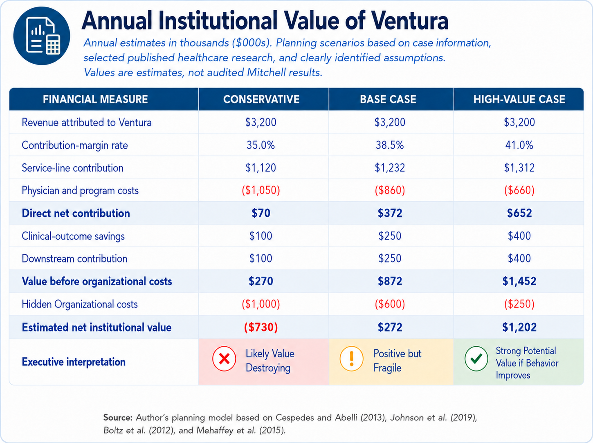
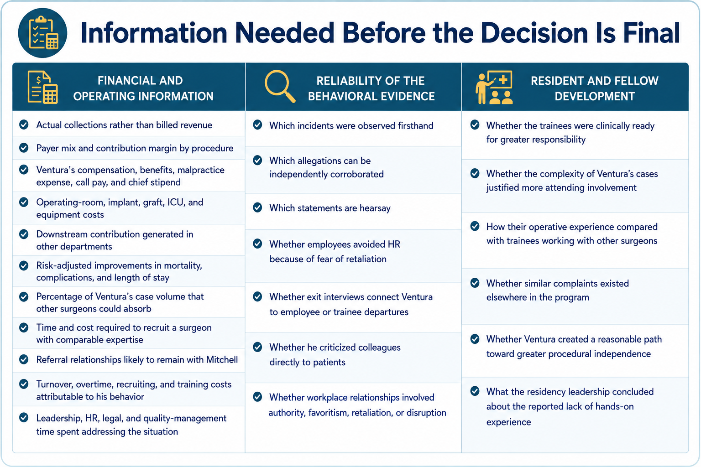
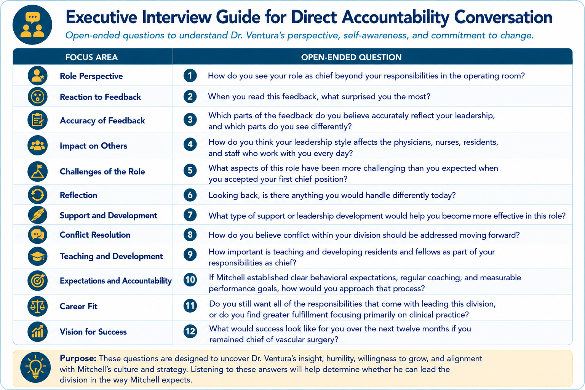
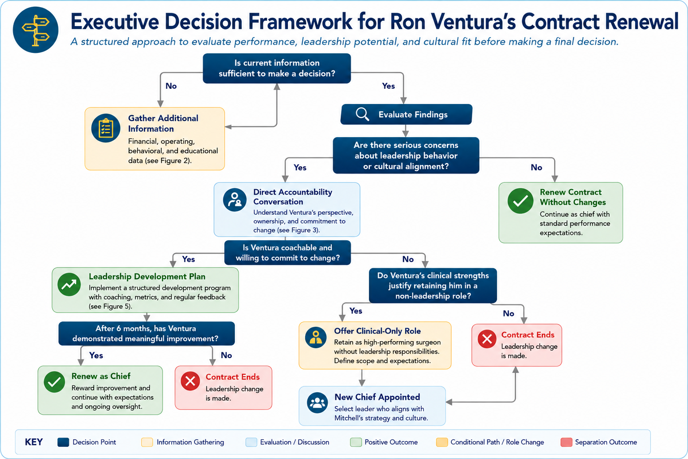
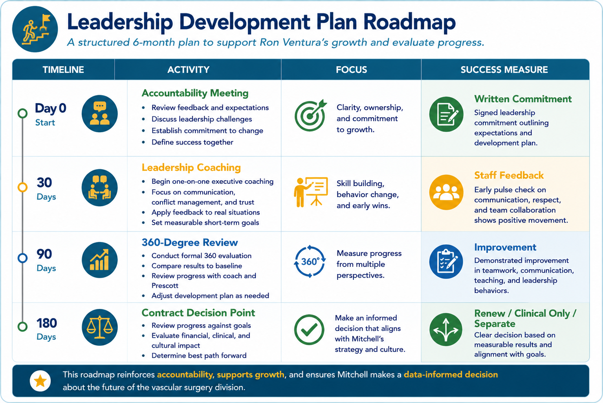

Andy Prescott’s decision goes beyond weighing Ron Ventura’s surgical expertise against his reputation as a difficult colleague. Ventura has raised the bar for Mitchell Memorial Hospital’s vascular surgery program—improving outcomes, attracting referrals, and generating revenue. But his leadership approach may be undermining the teamwork, communication, teaching, and professional respect that Mitchell has worked hard to build. The decision comes down to whether a surgeon who delivers exceptional individual results can also support the team-based system Mitchell needs to sustain them.

## Mitchell Memorial Hospital’s Strategy

Mitchell is pursuing focused differentiation by building its regional reputation around superior clinical outcomes, patient safety, and coordinated care. As a 750-bed regional academic medical center, much of its revenue and reputation is concentrated in three centers of excellence: cancer, cardiovascular disease, and orthopedics. Rather than competing primarily on price or patient volume, the hospital is building a stronger regional position around complex care delivered through specialized, multidisciplinary teams.

Jane McAdams was recruited as CEO to strengthen Mitchell’s position in an increasingly competitive healthcare environment. Under her leadership, the hospital began reinforcing teamwork, innovation, professional respect, and shared accountability through its clinical priorities, physician expectations, and management systems.

Mitchell organized much of this work through Integrated Practice Units (IPUs). Rather than allowing specialists to operate independently within traditional departments, the hospital organized care around the patient’s medical condition. Physicians, nurses, residents, and support staff were expected to coordinate the full continuum of care and give patients one cohesive care experience.

The hospital reinforced that model through the Team Mitchell physician compact, its code of conduct, collaboration-based incentives, physician leadership roles, multidisciplinary teams, and 360-degree evaluations. The approach is not only about hiring talented physicians. It is about turning individual expertise into integrated patient care. Teamwork is more than a value statement—it is a core capability the hospital needs to make that model work.

## The Cardiovascular Center’s Role in the Strategy

The Cardiovascular Center plays both a financial and an operating role in Mitchell’s strategy. As the hospital’s second-largest center of excellence, it generates revenue, attracts outside referrals, strengthens Mitchell’s regional reputation, and creates additional activity across diagnostic, surgical, and inpatient services.

It also provides one of Mitchell’s clearest examples of the IPU model. Prescott brought cardiology, cardiac surgery, vascular surgery, and vascular and interventional radiology under a single coordinated structure. Specialists shared information, worked in closer proximity, and organized treatment around the patient rather than traditional departmental boundaries.

Ventura’s expertise, clinical outcomes, and referrals add significant value to the Cardiovascular Center, but Mitchell gains more when he works effectively with the broader care team. The center supports revenue and referrals while also testing whether the hospital can align powerful specialists around one approach to patient care.

## Mitchell’s Culture and Whether It Supports the Strategy

Under McAdams’ leadership, the hospital began developing a more patient-centered culture around teamwork, collaboration, innovation, professional respect, teaching, and shared accountability. These expectations were closely connected to the coordinated, superior care Mitchell wanted to deliver.

The Team Mitchell physician compact expects physicians to place the patient first, include staff as members of the care team, support teaching and professional development, treat colleagues with respect, work toward shared organizational goals, and both provide and accept constructive feedback.

Mitchell’s intended culture supports its strategy, but the hospital had not yet made those expectations part of everyday practice. Employees had not formally reported concerns about Ventura, it was unclear what consequences followed a poor 360-degree review, and Prescott initially encouraged him to “smooth things over” instead of setting clear, measurable expectations. Mitchell had put the right policies in place, but its leaders were not yet applying them consistently.

Retaining Ventura without accountability would weaken the culture on which the IPU model depends and show employees that exceptional performance creates a separate set of rules for the hospital’s highest producers.

## Contract Renewal Decision

Based on the information available, I would not approve Ventura’s standard two-year contract as written. Before making a permanent decision, Mitchell should complete a short review of his institutional value, the reported conduct, and his willingness to change.

That position recognizes two competing risks. Mitchell cannot ignore the seriousness of the reported behavior, but it also does not have enough information to make a permanent decision with confidence. Numbers can clarify Ventura’s financial contribution, but Prescott still has to judge his credibility, coachability, and fit for the role.

### Ventura’s Economic Value

One of the biggest challenges in this case is separating Ventura’s revenue production from his overall value to Mitchell Memorial Hospital. The case reports that Ventura generated approximately $3.2 million in annual hospital revenue, but revenue alone does not show whether he creates or destroys value for the organization over the long term.

A more complete assessment includes the cost of generating that revenue, the financial benefit of improved outcomes and outside referrals, and the hidden organizational costs associated with Ventura’s behavior. Because the case does not provide enough financial detail to calculate Ventura’s exact contribution, I developed a planning model using the financial information reported in the case, published research on vascular-surgery contribution margins and the costs associated with complications and extended length of stay, and clearly identified assumptions for expenses the case does not disclose. The goal is not to produce an exact valuation, but to see whether reasonable changes in the assumptions would change the decision.

*Figure 1. Estimated Annual Institutional Value of Ventura.*

The base-case scenario estimates Ventura’s annual contribution at approximately $272,000. Under more optimistic assumptions, that amount could approach $1.2 million annually. Under conservative assumptions—particularly if turnover and organizational disruption are greater than estimated—Ventura could become a net financial loss of approximately $730,000 per year.

Even under the base case, the margin for error is relatively small. Losing one productive surgeon, several experienced nurses, or experiencing a major legal or patient-safety event could eliminate much of Ventura’s estimated contribution. The opposite risk also deserves consideration: replacing Ventura would be difficult, his reputation attracts complex referrals, and some referral relationships could leave with him.

The model does not prove whether Ventura should stay or leave. It shows that his contribution could range from value-destroying to strongly positive depending on costs the case does not disclose. The available evidence therefore does not establish that he is financially indispensable.

### Information Needed Before the Decision Is Final

Before deciding on a permanent contract, Prescott needs a clearer picture of Ventura’s financial contribution, the reliability of the behavioral concerns, and his effect on the residency program.

*Figure 2. Information Needed Before the Decision Is Final.*

Mitchell’s internal financial records would allow leadership to replace planning assumptions with actual collections, procedure-level contributions, operating costs, downstream revenue, recruitment exposure, and referral-retention estimates.

The behavioral review should separate firsthand observations and independently corroborated events from hearsay. It should also consider whether employees avoided formal reporting because they feared retaliation or believed their concerns would not be addressed. The educational review should compare trainee readiness, case complexity, operative experience, and performance across the broader residency program.

This additional information would not make Prescott’s choice easy. It would, however, help Mitchell distinguish between problems that may respond to coaching and accountability and those that reflect a pattern inconsistent with the organization’s long-term direction.

### Mitchell’s Responsibility to Develop a First-Time Chief

Mitchell expects physicians to collaborate, develop future doctors, and lead multidisciplinary teams. If the hospital expects first-time chiefs to succeed in that role, it must also prepare them for it.

Ventura appears to have accepted his first chief position at Mitchell after leaving a hospital where advancement opportunities were limited. Technical expertise alone does not prepare someone to mentor residents, build collaborative teams, manage conflict, or lead an entire service line.

Prescott recognized that conflict was developing but initially encouraged Ventura to “smooth things over” rather than clearly defining the behaviors that needed to change or establishing measurable expectations. The case also provides little evidence that Mitchell offered formal onboarding, mentoring, executive coaching, or leadership development after promoting Ventura into the chief role.

Ventura is ultimately responsible for his own behavior and leadership decisions. Mitchell develops residents and fellows through structured training. It should bring the same discipline to the development of physician leaders. That does not excuse Ventura’s actions, but it supports one structured opportunity to determine whether he can improve.

### The Direct Accountability Conversation

Before making a final decision on the contract, Prescott should have a direct, documented conversation with Ventura about accountability, leadership, and whether he is the right long-term fit for Mitchell.

> *When you joined Mitchell as chief, your clinical contribution exceeded expectations. At the same time, the feedback suggests your leadership approach is affecting trust, communication, teaching, and collaboration within the division. Mitchell also should have addressed these concerns earlier and provided clearer leadership support. My goal is to understand how you see the situation, what you believe needs to change, and whether we can move forward together.*

*Figure 3. Executive Interview Guide for the Direct Accountability Conversation.*

Ventura’s response may be the most useful information Prescott receives. If he asks thoughtful questions, acknowledges the effect of his conduct, and shows a genuine desire to improve, Mitchell has something to develop. If he rejects the feedback, blames employees, or wants the authority of the chief position without its teaching and collaborative responsibilities, then the role is probably not the right fit.

One lesson I carried from owning a small business is that leaders often overestimate the value of difficult employees because they focus on what might be lost if that person leaves. In my experience, that perceived value often shrank once the person was gone and the organization adjusted. That makes me cautious about allowing Ventura’s clinical production and reputation to make him appear more indispensable than he may actually be.

I have also learned that some of the best leadership decisions begin with understanding the person sitting across the table. A written case cannot capture personality, character, coachability, or sincerity. Those judgments can only be made through direct conversation, and they are an important part of deciding whether Ventura’s future belongs at Mitchell.

### Recommended Decision and Development Plan

Based on the information available, I would not approve Ventura’s standard two-year renewal. Immediate nonrenewal stemming solely from the first formal 360-degree review would overlook the process weaknesses Mitchell helped create, while an unconditional renewal would ignore the seriousness of the concerns.

*Figure 4. Executive Decision Framework for Ron Ventura’s Contract Renewal.*

If Ventura accepts responsibility, Mitchell should offer a six-month development agreement with clear expectations, protected feedback, and a defined decision point.

*Figure 5. Leadership Development Plan Roadmap.*

The development process should apply only if Ventura accepts responsibility and agrees to measurable oversight. Threatening conduct, discriminatory or sexualized comments, substantiated retaliation, intimidation involving patient-care concerns, disparaging colleagues to patients, or misuse of authority should trigger immediate action rather than gradual coaching.

If Ventura demonstrates meaningful improvement, Mitchell could renew his contract as chief or retain him in a clinical-only role with clearly defined expectations. If he rejects the feedback, refuses the plan, retaliates, or repeats a serious violation, Mitchell should allow the contract to expire.

Purposeful leadership requires Ventura to understand that the chief role is not primarily about his own authority or individual performance. He serves patients, trainees, colleagues, and the care system they depend on. Mitchell should give him one fair opportunity to demonstrate that he can meet that responsibility, but the opportunity cannot be open-ended.

## The Message Sent to Mitchell’s Staff

Employees will judge what Mitchell values by the decision Prescott makes.

An unconditional renewal would signal that revenue, reputation, and technical skill carry more weight than conduct, that high producers operate under different rules, and that honest participation in the 360-degree process does not produce meaningful action. Immediate nonrenewal without a fair investigation could send a different but equally problematic signal: that a single evaluation process or a collection of anonymous comments can end a career without corroboration or an opportunity to respond.

The staged approach communicates a more credible standard:

> *At Mitchell, clinical excellence, professional growth, and accountability are expected together. Exceptional performance earns a fair process and access to development, but it does not provide immunity from the standards required to protect patients and support the team.*

More specifically, it tells employees that results and conduct are both part of performance, the Team Mitchell compact applies to the hospital’s highest producers, employees must be able to raise concerns without intimidation or retaliation, and first-time leaders receive a fair opportunity to improve while continued leadership depends on measurable change.

A surgeon can be demanding without being demeaning. A leader can be decisive without silencing the team. Mitchell’s lasting advantage depends on both clinical excellence and the culture required to sustain it.

## References

::: {#refs}
:::
