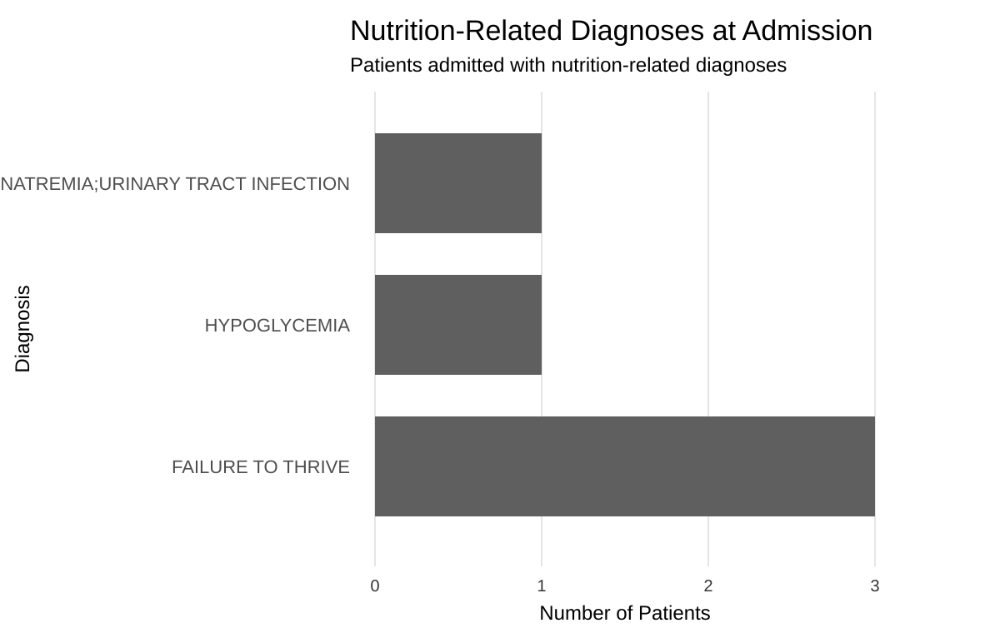
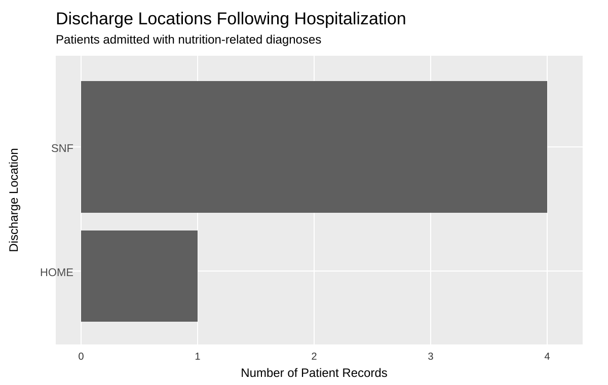

## Executive Summary

Healthcare organizations generate massive amounts of data, yet turning that information into meaningful action remains a challenge. A review of *What's Your Data Strategy?* and supporting healthcare research reveals a common issue: organizations often focus too heavily on either managing data risk or creating value from data, rather than finding the right balance between the two. Strong governance, data quality, privacy, and compliance create the foundation for trust by ensuring information is accurate, consistent, and reliable. While these capabilities help reduce risk and build confidence in the information being used, the greatest value comes when that foundation is paired with analytics and decision-support tools that improve clinical and operational decision-making.

Healthcare operates in a uniquely complex environment because patient information is highly sensitive, heavily regulated, and directly connected to patient safety. At the same time, healthcare leaders are expected to improve patient flow, staffing efficiency, resource allocation, and overall organizational performance. Meeting those expectations becomes difficult when the information needed to support decisions is spread across multiple systems and departments. Research shows that many healthcare organizations face challenges related to fragmented systems, inconsistent data definitions, interoperability issues, and the translation of large volumes of information into actionable insights.

A balanced data strategy is essential for healthcare organizations. Addressing challenges such as fragmented systems, inconsistent information, and growing operational demands requires clear governance structures, standardized data definitions, and accountability for data quality while continuing to expand analytics capabilities that support clinical and operational decision-making. Organizations that achieve this balance are better equipped to improve patient outcomes, operate more efficiently, and make better use of the data they already collect.

## Introduction

Although organizations collect more data than ever before, many still struggle to turn that information into actionable results. The challenge is not collecting more data, but developing a strategy that ensures the data is accurate, trusted, accessible, and ultimately useful to the people making decisions. Simply having access to large amounts of information does not automatically lead to better decisions, improved performance, or a deeper understanding of what is happening within the organization.

A central theme of *What's Your Data Strategy?* is the need to balance two important priorities: protecting information and using it. Defensive data strategies focus on governance, privacy, security, compliance, and data quality to ensure information is accurate, consistent, and properly managed. Offensive data strategies focus on using that information to support analytics, forecasting, decision-making, and organizational improvement. While defensive efforts help reduce risk and build trust in the underlying information, offensive efforts help organizations create value by turning information into meaningful action [@dallemule2017s].

Many organizations naturally lean toward one side of this equation. Some invest heavily in governance and control but fail to fully leverage their data to generate meaningful insights, while others move quickly into dashboards, analytics, and predictive modeling without first establishing the standards needed to ensure the underlying data can be trusted. The appropriate balance is not the same for every organization and often depends on industry requirements, regulatory pressures, and strategic priorities. Long-term success depends on finding the right balance between these approaches and aligning that strategy with the organization's goals, operating environment, and tolerance for risk [@dallemule2017s].

Another challenge is that different parts of a business often need different views of the same information. Finance, operations, clinical teams, and leadership may use information differently, but they must still work from a common, trusted foundation. Achieving that balance requires clear ownership, shared definitions, and accountability for how information is managed across the organization. Governance helps create consistency while still allowing departments the flexibility to use information in ways that support their specific needs. Technology plays an important role, but technology alone is not a strategy. Sustainable success depends on leadership, governance, and a deliberate approach to turning information into better decisions, improved performance, and stronger patient outcomes [@dallemule2017s].

## The Healthcare Context

The challenges described in *What's Your Data Strategy?* are especially visible in healthcare, where data quality, accessibility, and decision-making can directly affect both patient outcomes and operational performance. Healthcare systems generate enormous amounts of information through electronic health records, laboratory and imaging systems, pharmacy platforms, billing applications, and operational databases. However, much of this information remains fragmented across systems and departments, making it difficult to create a complete view of clinical and organizational performance [@dallemule2017s].

Fragmented systems, inconsistent definitions, and limited interoperability remain common challenges across healthcare. Clinical teams, finance departments, operations leaders, and quality teams often rely on systems that do not communicate effectively with one another. As a result, organizations may have access to large volumes of data yet still find it difficult to answer basic questions about performance, resource utilization, outcomes, and future needs. Healthcare can quickly become data-rich but insight-poor.

These challenges are particularly important because healthcare operates within a highly regulated environment. Patient information is sensitive, privacy requirements are strict, and data errors can affect reimbursement, quality reporting, operational planning, staffing decisions, and ultimately the care patients receive. Research has shown that poor data quality can negatively affect decision-making and organizational performance, highlighting the need for standardized definitions, governance structures, and accountability for data quality [@gavgani2024data; @guptadata].

At the same time, healthcare leaders face growing pressure to use data more effectively. Rising costs, workforce shortages, capacity constraints, and increasing demands for quality improvement require faster and more informed decision-making. Predictive analytics and decision-support tools can help identify high-risk patients, improve patient flow, optimize staffing, support capacity planning, and allocate resources more effectively.

This capability is particularly important for nutrition-related conditions. Research has shown that malnutrition is independently associated with higher mortality, longer hospital stays, increased infections, ICU readmissions, and greater healthcare resource utilization. Early identification of at-risk patients creates opportunities for earlier intervention, potentially improving outcomes while reducing avoidable resource use and associated costs [@lew2017malnutrition].

Healthcare data challenges do not end when a patient leaves the hospital. Effective transitions of care depend on accurate and timely information exchange between hospitals, skilled nursing facilities, rehabilitation centers, and other post-acute care providers. Research has identified communication breakdowns and information-transfer gaps as important contributors to avoidable rehospitalizations and disruptions in patient care, highlighting the need for standardized and accessible patient information across care settings [@keim2020].

These challenges illustrate how defensive and offensive data strategies work together in healthcare. Accurate documentation creates a trusted foundation for decision-making, while analytics can be used to identify high-risk patients, prioritize resources, support earlier intervention, and improve outcomes. Nutrition-related care provides a useful example of both approaches. The analyses that follow use nutrition-related data to demonstrate both approaches. The first identifies patients with diagnoses associated with malnutrition risk at admission and illustrates how clinical data can support earlier intervention and resource prioritization. The second examines discharge locations for patients with nutrition-related diagnoses and highlights the importance of accurate documentation, continuity of care, and data quality as patients transition between care settings.

## Data Visualizations

### Visualization One: Offensive Data Strategy

#### Identifying Patients at Risk for Malnutrition at Admission

{fig-alt="Bar chart of nutrition-related diagnoses at admission. Failure to thrive appears in three patient records, while hypoglycemia and hyponatremia with urinary tract infection each appear in one."}

This visualization highlights patients with diagnoses commonly associated with malnutrition risk, including conditions such as malnutrition, failure to thrive, dysphagia, cachexia, and other nutrition-related diagnoses. The findings demonstrate that a meaningful number of patients enter the hospital with conditions that may increase their risk of poor nutritional status and adverse clinical outcomes. Identifying these patients at admission creates an opportunity for earlier intervention and more proactive nutrition care. This is particularly important because malnutrition has been associated with higher mortality, longer hospital stays, increased infections, ICU readmissions, and greater healthcare resource utilization [@lew2017malnutrition].

From a data strategy perspective, this represents an offensive use of healthcare data. Rather than focusing solely on documentation and compliance, the information is being used to support action and improve decision-making. Existing clinical data can help identify patients who may benefit from earlier nutrition assessment, closer monitoring, and targeted interventions before complications develop. This allows healthcare teams to move beyond simply recording information and begin using it to guide care.

### Visualization Two: Defensive Data Strategy

#### Discharge Locations and Care Transitions

{fig-alt="Bar chart of discharge locations following hospitalization for patients admitted with nutrition-related diagnoses. Four records were discharged to skilled nursing facilities and one to home."}

This visualization shows the discharge locations of patients admitted with nutrition-related diagnoses, including conditions such as failure to thrive, malnutrition, dysphagia, hypoglycemia, hyponatremia, and unintentional weight loss. Most patients in this sample were discharged to skilled nursing facilities rather than home, suggesting that many require ongoing support beyond the acute-care hospital setting. Although the sample size is limited, the findings highlight the importance of effective care transitions as patients move between healthcare settings. Research has shown that many rehospitalizations occur within the first two weeks after discharge, emphasizing the need for effective communication and coordination during transitions of care [@keim2020].

From a data strategy perspective, this represents a defensive use of healthcare data. Discharge location is a critical administrative data element that supports care coordination, reporting, reimbursement, and regulatory compliance. Because patients often transition between organizations and providers, discharge information must be documented accurately and consistently. Incomplete or inconsistent documentation can create communication gaps between care teams, reduce confidence in organizational reporting, and make it more difficult to ensure patients receive appropriate follow-up care. These findings demonstrate why strong documentation standards, data quality practices, and governance remain essential for maintaining trusted information across healthcare settings.

## Recommendations for Industry

The findings from both analyses suggest several opportunities for healthcare leaders to strengthen their data strategies while improving patient care and operational performance.

First, healthcare organizations should implement standardized nutrition-risk screening at admission. Diagnosis-based alerts and flags within the electronic health record can help automatically identify patients with conditions associated with malnutrition risk and prioritize them for Registered Dietitian assessment. Standardizing this process can support earlier intervention, improve the allocation of nutrition resources, and shift care from a reactive approach to a more predictive and preventive model of care.

Second, healthcare organizations should strengthen transition-of-care documentation. Standardized discharge destination fields, consistent documentation requirements, and improved information sharing between care settings can help ensure key nutrition-related information follows the patient after discharge. Improving the quality and consistency of transition-of-care documentation can strengthen continuity of care, reduce communication gaps, and support more reliable reporting and decision-making.

Finally, healthcare organizations should continue investing in data quality and governance. This includes defining key documentation fields consistently, auditing high-risk patient records for completeness and accuracy, and establishing standards that improve the reliability of clinical information across departments and care settings. Accurate, trusted data is essential because both offensive and defensive data strategies depend on a strong informational foundation.

Together, these recommendations reinforce the central message of *What's Your Data Strategy?*. Healthcare organizations create the greatest value when they balance strong governance and data quality with analytics and decision-support capabilities that transform information into meaningful action.

## References

::: {#refs}
:::
