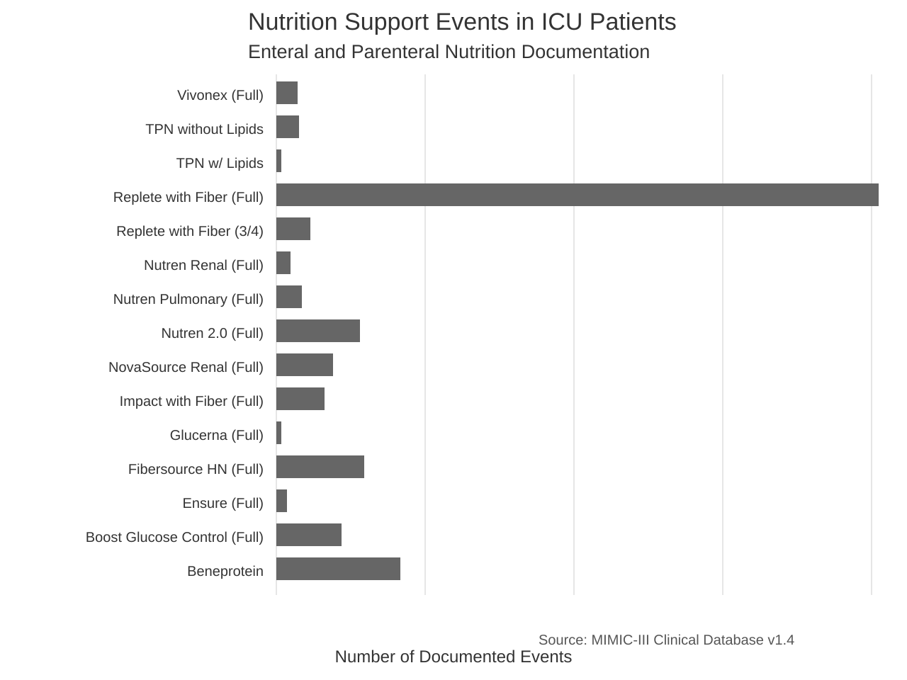
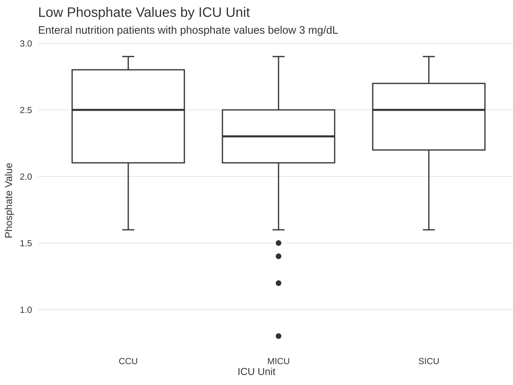

## Data Visualizations

### Visualization One - Two Table Join

This first visualization looks at documented nutrition support events among ICU patients. The goal was to show how connecting information from different parts of the hospital database can transform raw data into insights that support clinical and operational decision-making.

The INPUTEVENTS_MV table tracks what items are given to patients, but it mostly uses numeric item IDs for nutrition products. On their own, these numbers do not mean much to clinicians or administrators. The D_ITEMS table acts like a hospital dictionary because it translates those item IDs into recognizable labels and categories.

To make the data useful, INPUTEVENTS_MV and D_ITEMS were linked using the shared itemid field. This step connects the record of what was given to patients with clear descriptions of those products, making the information much easier to interpret and act on.

{fig-alt="Bar chart showing documented enteral and parenteral nutrition support events among ICU patients, with enteral products documented more frequently than parenteral products."}

The results show that enteral nutrition products were documented far more frequently than parenteral nutrition products in this dataset. Replete with Fiber was the most frequently documented product, while TPN products were documented much less often. It is important to note that this graph counts documented nutrition support events rather than unique patients. If a patient received the same product several times, each event is counted separately.

For healthcare organizations, this example demonstrates why data integration matters. The administration table alone shows that something was given, but not in a way that is easy to interpret. The dictionary table alone shows what products exist, but not whether they were actually used in patient care. By joining the two tables, organizations can begin to understand how nutrition support products are being utilized across the ICU.

This example reflects a broader principle of healthcare analytics: organizations already collect large volumes of clinical and operational data, but the greatest value comes from combining and analyzing that information in ways that support better decisions (@raghupathi2014big). It also highlights the importance of interoperability, as information often must be connected across systems before meaningful patterns become visible (@nan2023designing).

For hospital leaders, this type of analysis can support inventory planning, product standardization, purchasing decisions, oversight of nutrition support practices, and quality improvement initiatives. It also creates the foundation for more advanced analytics and clinical decision support. Once an organization can identify which patients are receiving nutrition support, it can begin linking that information to laboratory values, medication use, complications, and patient outcomes.

### Visualization Two - Three Table Join

While the first visualization focused on nutrition support utilization, the second extends the analysis by linking nutrition support documentation to laboratory monitoring data and ICU unit information. The goal was to show how bringing together data from different clinical systems can provide a more complete view of patient care and help identify patterns that may otherwise go unnoticed.

This analysis uses a three-table join involving INPUTEVENTS_MV, LABEVENTS, and ICUSTAYS. INPUTEVENTS_MV identifies patients receiving enteral nutrition support, LABEVENTS contains laboratory results collected during the admission, and ICUSTAYS provides information about the ICU unit where the patient received care.

{fig-alt="Boxplot showing phosphate values below 3 mg/dL among patients receiving enteral nutrition support, grouped by ICU unit."}

The boxplot displays phosphate values below 3 mg/dL among patients receiving enteral nutrition support, organized by ICU unit. Limiting the analysis to low and borderline-low phosphate values focuses attention on patients who may be at greater risk for electrolyte abnormalities. Given that the normal phosphate reference range is approximately 2.5 to 4.5 mg/dL, this visualization highlights a subset of patients receiving nutrition support who may require closer monitoring and follow-up (@dasilva2020aspen; @mccray2005refeeding).

Low phosphate values were present across the CCU, MICU, and SICU groups, although the MICU group showed the lowest outlier values and a slightly lower overall distribution than the other units. While this does not prove that MICU patients are at higher risk, the findings suggest that medical ICU patients receiving enteral nutrition may represent an important population for closer electrolyte monitoring and targeted clinical decision support (@dasilva2020aspen).

This analysis demonstrates the value of combining information from multiple clinical systems. Nutrition support documentation alone does not capture laboratory abnormalities, and laboratory values by themselves do not indicate whether nutrition therapy is being delivered. ICU unit information adds important clinical and operational context. Together, these datasets make it possible to identify patients receiving enteral nutrition who also have low phosphate levels and determine where those abnormalities appear most frequently across ICU settings.

Integrated datasets also provide the foundation for Clinical Decision Support Systems that help clinicians identify patients who may require closer monitoring or intervention (@sutton2020overview). In this example, combining nutrition support, laboratory, and ICU-unit information creates a more complete picture of patient risk and supports more informed clinical decision-making.

This analysis is especially relevant from a patient safety perspective because phosphorus is routinely monitored in patients receiving nutrition support, particularly among critically ill populations. Low phosphate levels often indicate the need for additional assessment or intervention, making early identification an important clinical priority. The ability to identify where these abnormalities occur most frequently may help organizations evaluate monitoring practices and focus improvement efforts where they are likely to have the greatest impact (@dasilva2020aspen; @mccray2005refeeding).

This type of integrated data also creates opportunities for more advanced analytics. Rather than reporting low phosphate values only after they occur, healthcare organizations can apply predictive analytics and machine learning to identify patients at risk for complications earlier in their hospital stay. Over time, combining variables such as nutrition support status, phosphate trends, ICU unit, medication use, mechanical ventilation status, severity of illness, and recent intake history can support earlier risk identification and enable more proactive clinical decision-making (@raphaeli2023machineLearning).
