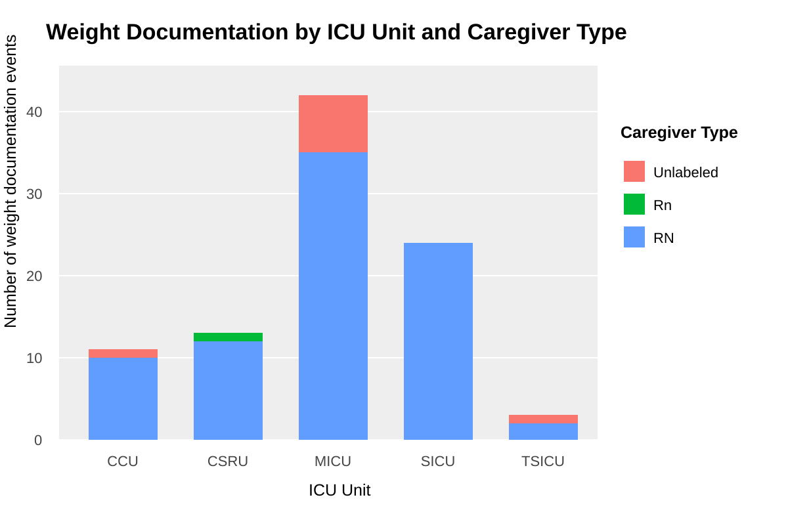
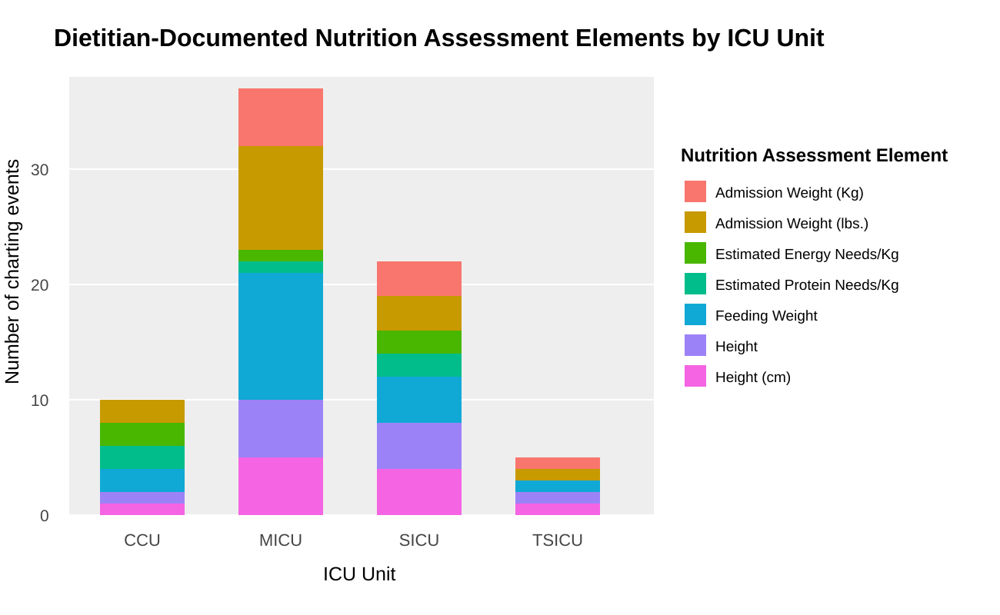

## Data Visualizations

### Visualization One
#### Daily Weight Documentation by ICU Unit and Caregiver Type

The first visualization shows how often daily weight was documented in each ICU unit and which caregiver types entered the information. Instead of only counting weight entries, this approach uses the CAREGIVERS table to connect each entry to the caregiver role behind it.

The process began by identifying the item ID for daily weight in the MIMIC-III database. Since CHARTEVENTS uses item IDs rather than plain-language labels, the weight-related fields had to be searched first. Item ID 763 was identified as the daily weight field used for this analysis.

CHARTEVENTS was used as the main table because it contains the actual daily weight documentation events. The table was joined to CAREGIVERS using cgid to identify the caregiver type associated with each entry. ICUSTAYS was also joined using icustay_id, which linked each weight documentation event to the patient’s ICU unit.

The WHERE clause filtered the data to include only daily weight records with values greater than zero. This helped remove blank, missing, or unusable entries. The query then used COUNT(*) to count the number of documentation events and grouped the results by ICU unit and caregiver type. The final query asks: for each ICU unit, how many daily weight documentation events were entered, and which caregiver types entered them?

{fig-alt="Stacked bar chart showing daily weight documentation events by ICU unit and caregiver type."}

The graph indicates that nurses entered the majority of daily weight documentation events. Most caregiver labels appear as RN, but some entries are Rn, and at least one category lacks a clear caregiver label. This is a small but important data quality finding. If the same caregiver role is documented with different capitalization, or if some caregiver IDs lack clear labels, the data becomes harder to summarize and trust. Leaders should consider whether this reflects a simple labeling issue or a broader problem with role mapping, documentation standards, or data governance.

The graph also shows differences across ICU units. MICU had the highest number of daily weight documentation events, followed by SICU, while TSICU had far fewer. This does not automatically mean one unit is performing better or worse. The chart counts documentation events, not unique patients, and it does not adjust for census, patient acuity, or length of stay. However, these differences raise important questions. If certain units have longer ICU stays but fewer daily weight entries, leaders may need to review whether weights are being captured consistently, whether staff recognize the importance of ongoing weight monitoring, or whether this information is being recorded somewhere else in the EHR.

From a workflow perspective, the graph suggests that daily weight documentation may be concentrated among nurses. If this responsibility falls primarily on nursing staff, it could add to documentation burden in an already demanding ICU environment. Leaders should evaluate whether patient care technicians could support weight documentation and whether dietitians, physical therapists, or speech-language pathologists have access to update weight fields when appropriate. If those disciplines document weight-related information somewhere else, the organization may need to review where that data lives and how it is used.

This visual reinforces that daily weight documentation is both a clinical workflow issue and a data quality issue. Weight supports multiple aspects of care, but it only becomes useful for reporting, dashboards, and decision support when it is documented consistently and linked to clear caregiver roles. Without that foundation, future analytics or AI tools may produce incomplete or misleading results [@de2026discovery].

### Visualization Two
#### Dietitian-Documented Nutrition Assessment Elements by ICU Unit

The second visualization examines nutrition-related documentation entered by dietitian-type caregivers in the ICU. The goal was to identify which nutrition assessment elements were documented by dietitian-related roles and how those patterns varied across ICU units.

The process started with the CAREGIVERS table to understand how MIMIC identifies dietitians. This was not as simple as searching for one label. The CAREGIVERS table included several dietitian-related labels, including RD, DI, DietIn, RD Int, RD/LDN, RD,LDN, and MS,RD. These labels were used to identify charting events entered by nutrition-related professionals.

CHARTEVENTS was used because it contains the actual charting events and includes the caregiver ID attached to each entry. By joining CHARTEVENTS to CAREGIVERS, the query could connect nutrition-related entries back to the type of caregiver who entered them. D_ITEMS was then added because CHARTEVENTS stores charted fields using item IDs, while D_ITEMS provides plain-language descriptions of each field. This helped identify nutrition-related fields, including Estimated Energy Needs/Kg, Estimated Protein Needs/Kg, Feeding Weight, Admission Weight, Height, and Height (cm). ICUSTAYS was also joined, so each entry could be compared across ICU units.

The final query asks: for each ICU unit, how many nutrition-assessment fields were documented by dietitian-type caregivers?

{fig-alt="Stacked bar chart showing dietitian-documented nutrition assessment elements by ICU unit."}

The graph indicates that dietitian-documented nutrition assessment fields were most frequently recorded in the MICU, followed by the SICU. Fewer charting events appeared in the CCU and TSICU, and no CSRU documentation was identified in this output. This does not necessarily mean dietitians were not involved in those units. Documentation may have been entered elsewhere, under different caregiver roles, or in fields not captured by this query. That uncertainty is part of the informatics issue. When data is difficult to locate or scattered across multiple areas of the EHR, it becomes harder for leaders to evaluate nutrition care consistently.

The graph also shows several data standardization issues. As seen in the first visualization, caregiver labels for dietitians are inconsistent, appearing as RD, DI, DietIn, RD Int, RD/LDN, RD,LDN, and MS,RD. While these labels may be familiar to people within the organization, they complicate analysis. When the same role is entered in multiple ways, filtering, summarizing, and trusting the data becomes more difficult. Organizations relying on this information for reporting or dashboards need clearer role mapping and stronger data governance.

The nutrition assessment fields also show duplication in measurement units. Weight-related fields appear as Admission Weight (Kg) and Admission Weight (lbs.), while height appears as Height and Height (cm). These differences matter because structured data is easier to analyze when it is standardized. Without reliable units, conversion rules, and clear documentation standards, downstream tools may misread, duplicate, or exclude important information.

One important finding is that estimated energy and protein needs appear relatively low compared with the other fields. In ICU nutrition care, energy and protein needs are central to assessment and planning. Critically ill patients are at high risk for malnutrition, and nutrition risk assessment in the ICU can be difficult because traditional screening tools do not always identify the same patients [@coltman2015use]. Dietitians play an important role in setting nutrition targets, developing feeding plans, monitoring adequacy, and supporting nutrition delivery in critical care [@terblanche2025dietetic].

The lower number of calorie and protein need entries should be viewed as a documentation and workflow signal, not evidence that dietitians are not assessing patients. Leaders would need to review whether those estimates are documented in other locations, whether the consult process is consistent, whether ICU nutrition screening is built into the workflow, and whether dietitians have access to the right structured fields.

From a staffing and workflow perspective, this visualization prompts leaders to consider whether dietitian coverage aligns with ICU patient needs. If critically ill patients require nutrition assessment, feeding plans, and monitoring, but structured documentation is limited in certain units, leaders may need to review staffing levels, consult volume, unit expectations, and documentation standards. This reinforces that dietitian documentation is more than nutrition charting. It is also a workflow, data quality, and governance issue. Fields such as feeding weight, height, estimated energy needs, and estimated protein needs help turn clinical assessment into usable data. This shows why standardized documentation is needed before nutrition-related dashboards, alerts, or AI tools can be fully trusted.