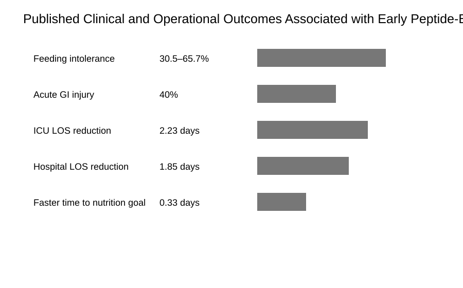
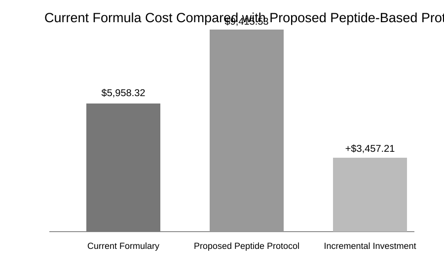
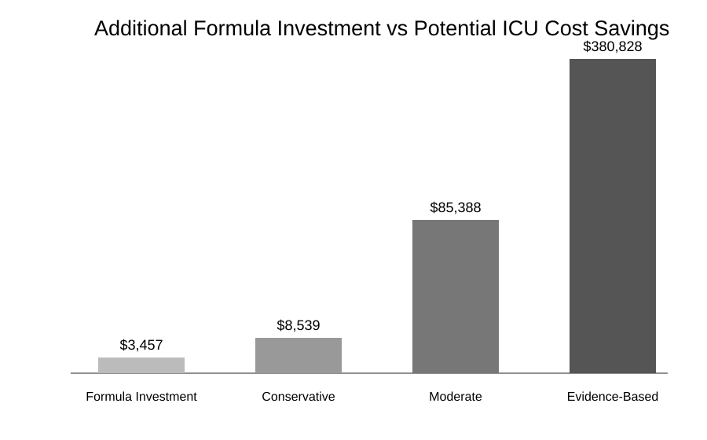
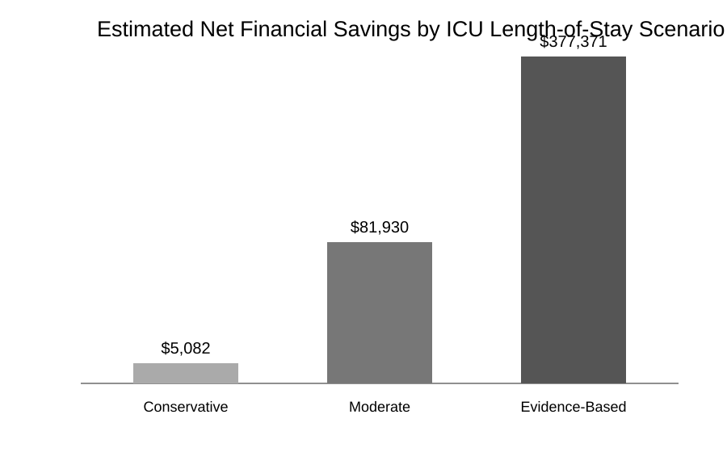

## Executive Summary

Hospitals face ongoing pressure to deliver better patient outcomes while controlling rising costs. Because intensive care units consume a disproportionate share of hospital resources, even modest reductions in ICU length of stay can produce meaningful clinical and financial benefits. While enteral nutrition formulas are often selected based on acquisition cost, this approach may overlook opportunities to reduce the total cost of care by improving patient outcomes [@halpern2015icu; @mcclave2016guidelines].

This analysis brings together patient-level nutrition support data from the MIMIC-III critical care database, estimated hospital acquisition costs, and published research on peptide-based enteral nutrition. Enteral nutrition utilization data were extracted from the electronic health record and combined with cost estimates to build a financial model comparing current practices with an early peptide-based enteral nutrition protocol. Several ICU length-of-stay scenarios were modeled using published clinical evidence to estimate the potential financial impact of adopting this approach [@bhurayanontachai2024peptide; @wang2023agi].

The analysis showed that while a peptide-based enteral nutrition protocol increases formula acquisition costs, this investment is minor compared to the total cost of critical care. Evidence-based scenarios indicate that even small reductions in ICU length of stay more than offset the higher nutrition costs. These results highlight the importance of viewing enteral nutrition as a strategic clinical intervention rather than just a supply expense. For healthcare administrators, this approach demonstrates how electronic health record data and financial modeling can inform purchasing decisions, optimize resource use, and enhance the value of care for critically ill patients.

## Introduction

Hospitals are continually challenged to improve patient outcomes while managing rising healthcare costs. Few areas illustrate this challenge more clearly than the intensive care unit (ICU), where critically ill patients require advanced technology, specialized clinicians, continuous monitoring, and complex multidisciplinary care. Although ICU patients represent a relatively small proportion of hospitalized patients, they account for a disproportionately large share of inpatient spending because of the intensity of resources required throughout their hospitalization [@halpern2015icu]. Recent estimates place the average cost of an ICU day at approximately $7,425, making even modest reductions in ICU length of stay financially meaningful while improving bed availability and operational efficiency [@sccm2024icu; @kff2024hospital].

As healthcare reimbursement continues to shift toward value-based care, hospital leaders are increasingly expected to evaluate therapies based on their impact on the total cost of care rather than on acquisition cost alone. Products with higher acquisition costs may ultimately reduce total healthcare expenditures if they improve clinical outcomes and reduce utilization of costly hospital resources. This shift has transformed purchasing decisions from selecting the least expensive product to identifying interventions that provide the greatest overall clinical and financial value.

Throughout this semester, analysis of nutrition support data from the MIMIC-III critical care database consistently showed reliance on standard polymeric enteral formulas, including Fibersource HN, Replete with Fiber, Nutren, NovaSource Renal, and Vivonex. While these formulas remain the recommended first-line therapy for most critically ill adults, the limited use of peptide-based or immune-modulating formulas raises an important operational question: could a higher-cost enteral formula reduce overall hospitalization costs by shortening ICU length of stay in these patients?

To explore this question, this report combines patient-level nutrition support data extracted from the MIMIC-III database with estimated hospital acquisition costs and published clinical evidence evaluating peptide-based enteral nutrition. Rather than comparing formula prices alone, this analysis models the potential financial impact of implementing an early peptide-based enteral nutrition protocol for ICU patients. The objective is to determine whether a relatively small increase in nutrition acquisition costs could be offset through reductions in ICU resource utilization, ultimately demonstrating how routinely collected electronic health record data can support evidence-based purchasing decisions and strategic resource allocation within healthcare organizations.

## The Healthcare Context

### Critical Care Nutrition and Resource Utilization

For critically ill patients unable to meet their nutritional needs orally, enteral nutrition remains the preferred method of nutritional support when the gastrointestinal tract is functional. Current ASPEN and SCCM guidelines recommend initiating enteral nutrition within 24 to 48 hours of ICU admission when clinically appropriate because early nutrition helps preserve gastrointestinal integrity, support immune function, and reduce infectious complications associated with delayed nutrition support [@mcclave2016guidelines].

Providing nutrition in the ICU, however, is often more complex than simply selecting a formula. Critical illness frequently alters normal gastrointestinal function through inflammation, reduced gut perfusion, mechanical ventilation, vasopressor therapy, and impaired gastrointestinal motility. These physiologic changes can reduce tolerance to enteral feeding, making it more difficult for patients to receive adequate nutrition during the early stages of critical illness.

From an operational perspective, inadequate nutrition delivery extends beyond nutritional concerns. Feeding interruptions often require additional nursing interventions, physician reassessment, medication adjustments, and repeated attempts to advance nutrition support. These challenges may delay achievement of nutrition goals, increase resource utilization, and contribute to prolonged ICU stays.

### Feeding Intolerance and the Role of Peptide-Based Formulas

Feeding intolerance is one of the most common barriers to successful enteral nutrition in critically ill patients. Recent studies estimate that 30.5% to 65.7% of ICU patients receiving enteral nutrition experience some degree of feeding intolerance, while approximately 40% develop acute gastrointestinal injury [@bhurayanontachai2024peptide; @wang2023agi]. Common manifestations include vomiting, diarrhea, abdominal distension, delayed gastric emptying, and inability to achieve prescribed feeding goals.

Current clinical guidelines recommend standard polymeric formulas as the first-line enteral nutrition therapy for most critically ill adults. Emerging evidence, however, suggests that peptide-based formulas may improve feeding tolerance, nutrient delivery, and gastrointestinal function in patients experiencing feeding intolerance or acute gastrointestinal injury. This raises an important operational question: should hospitals evaluate whether initiating all ICU patients on a peptide-based formula during the early phase of critical illness could improve resource utilization before transitioning appropriate patients to a standard polymeric formula? Unlike standard formulas, peptide-based products contain hydrolyzed proteins that require less digestive processing and may improve nutrient absorption in patients experiencing gastrointestinal dysfunction or feeding intolerance.

Although the published evidence primarily evaluates patients at high risk for feeding intolerance or acute gastrointestinal injury, these findings provide a rationale for evaluating whether an early peptide-based enteral nutrition protocol could improve nutrition delivery across the broader ICU population. Because registered dietitians routinely reassess enteral nutrition shortly after initiation, patients demonstrating adequate gastrointestinal tolerance could later transition to a standard polymeric formula, while those requiring continued support remain on a peptide-based regimen. This approach emphasizes early optimization of nutrition delivery while preserving individualized nutrition care.

### Implications for Hospital Operations

While much of the published evidence has focused on patients with feeding intolerance or acute gastrointestinal injury, the findings suggest that improving feeding tolerance may also improve operational efficiency by reducing delays in nutrition delivery and utilization of ICU resources. Table 1 summarizes the key clinical findings from the literature and their operational significance.

**Table 1. Published Clinical and Operational Outcomes Associated with Early Peptide-Based Enteral Nutrition**

| Clinical Finding | Published Evidence | Operational Significance |
|---|---|---|
| Enteral feeding intolerance | 30.5–65.7% of ICU patients experience feeding intolerance | May delay nutrition delivery, increase nursing workload, and prolong ICU resource utilization. |
| Acute gastrointestinal injury (AGI) | Approximately 40% of critically ill patients develop AGI | Identifies patients most likely to benefit from specialized enteral formulas. |
| ICU length of stay | Peptide-based formulas reduced ICU LOS by an average of 2.23 days | Reduces utilization of one of the hospital’s highest-cost resources. |
| Hospital length of stay | Overall hospital LOS reduced by an average of 1.85 days | Improves patient throughput, bed availability, and operational efficiency. |
| Time to nutrition goal | Patients reached calorie goals 0.33 days faster | Supports earlier achievement of prescribed nutrition goals. |
| Cost-effectiveness threshold | Semi-elemental formulas became cost-saving when feeding intolerance was prevented in more than 7% of patients | Suggests higher acquisition costs may be offset through reduced ICU resource utilization. |

{fig-align="center"}

The available evidence suggests that earlier use of peptide-based enteral nutrition has the potential to improve feeding tolerance, accelerate achievement of nutrition goals, and reduce ICU resource utilization during the early phase of critical illness. Because ICU care represents one of the hospital's most expensive resources, even modest improvements in feeding tolerance could translate into meaningful financial value. The following financial analysis combines MIMIC-III nutrition support data with estimated hospital acquisition costs to evaluate whether an early peptide-based enteral nutrition protocol could offset higher formula costs through reduced ICU resource utilization.

## Financial Analysis

### Financial Impact of an Early Peptide-Based Enteral Nutrition Protocol

The clinical evidence presented in the previous section suggests that earlier use of peptide-based enteral nutrition may improve feeding tolerance, optimize nutrition delivery, and reduce ICU resource utilization. The next question is whether extending this strategy as the initial enteral nutrition protocol for all ICU patients could translate into measurable financial value for the hospital.

To evaluate this opportunity, a financial model was developed using actual enteral nutrition utilization data extracted from the MIMIC-III database. The model assumes that ICU patients receiving standard polymeric enteral formulas would instead be started on Impact with Fiber (Full), which serves as the MIMIC equivalent of Impact Peptide 1.5 for this analysis. This approach demonstrates how routinely collected electronic health record data can be leveraged to evaluate the financial implications of formulary decisions before implementing changes in clinical practice.

### Current Enteral Nutrition Utilization

Analysis of the MIMIC-III cohort demonstrated that enteral nutrition was delivered primarily through standard polymeric formulas, including Fibersource HN, Replete with Fiber, Nutren products, and NovaSource Renal. Estimated hospital acquisition costs were assigned to each formula using modeled contract pricing to establish the baseline cost of the current formulary before comparing it with the proposed peptide-based protocol.

Table 2 summarizes the estimated enteral nutrition utilization and acquisition costs under the current formulary compared with the proposed peptide-based protocol. Across the cohort, transitioning ICU patients receiving standard polymeric formulas to Impact Peptide 1.5 increased projected formula expenditures from $5,958.32 to $9,415.53, representing an incremental investment of approximately $3,457.21.

Although the proposed protocol increases formula acquisition costs, the additional investment represents only a small portion of the overall expense associated with caring for a critically ill patient. Figure 2 illustrates that the increase in nutrition spending is relatively modest when compared with the total cost of ICU care, emphasizing the importance of evaluating enteral nutrition within the broader context of total cost of care rather than acquisition cost alone.

**Table 2. Current Formula Cost Compared with Proposed Peptide-Based Protocol**

| Measure | Current Formulary | Proposed Peptide Protocol |
|---|---:|---:|
| Total Enteral Formula Volume | 264,481 mL | 264,481 mL |
| Estimated Formula Acquisition Cost | $5,958.32 | $9,415.53 |
| Additional Formula Investment | — | $3,457.21 |

{fig-align="center"}

### Modeling the Financial Impact

Formula acquisition costs represent only a small fraction of the total expense associated with caring for a critically ill patient. To evaluate whether higher formula costs could be offset through reduced ICU utilization, three financial scenarios were modeled using an estimated ICU cost of $7,425 per day. These scenarios range from a conservative reduction in ICU length of stay to the 2.23-day reduction reported in the published literature evaluating peptide-based enteral nutrition. Table 3 summarizes the projected ICU cost avoidance and estimated net financial impact for each scenario.

**Table 3. Estimated Financial Impact by ICU Length-of-Stay Scenario**

| Scenario | ICU LOS Reduction | ICU Cost Avoided | Additional Formula Cost | Net Savings |
|---|---:|---:|---:|---:|
| Conservative | 0.05 days | $8,538.75 | $3,457.21 | $5,081.54 |
| Moderate | 0.50 days | $85,387.50 | $3,457.21 | $81,930.29 |
| Evidence-Based | 2.23 days | $380,828.25 | $3,457.21 | $377,371.04 |

*ICU cost avoidance estimated at $170,775 per ICU day.*

Across all modeled scenarios, the estimated reduction in ICU costs exceeded the additional investment required to implement the peptide-based nutrition protocol. Even under the most conservative assumptions, the projected savings suggest that relatively small improvements in ICU length of stay may offset the increased acquisition cost of specialized enteral formulas.

This relationship is illustrated in Figure 3, which compares the additional investment required to implement the peptide-based protocol to the estimated ICU cost savings for each modeled scenario.

{fig-align="center"}

### Return on Investment

Viewed through a value-based purchasing framework, these findings suggest that enteral nutrition should be evaluated according to its impact on total cost of care rather than formula acquisition cost alone. Within this proof-of-concept model, an additional investment of approximately $3,457 generated projected net savings ranging from approximately $5,000 under conservative assumptions to more than $377,000 under the evidence-based scenario. Although actual savings would depend on patient selection, clinical outcomes, and protocol adherence, the analysis demonstrates how routinely collected electronic health record data can support evidence-based purchasing decisions by quantifying both clinical and financial value.

Figure 4 summarizes the estimated net financial savings for each modeled scenario and illustrates that even modest reductions in ICU length of stay can yield a positive return on investment after accounting for increased formula acquisition costs.

{fig-align="center"}

## Strategic Recommendation

The findings from this analysis support implementing an evidence-based enteral nutrition protocol that initiates all ICU patients on a peptide-based formula as the standard initial feeding regimen. Initiating enteral nutrition with a peptide-based formula during the early phase of critical illness has the potential to improve early feeding tolerance, reduce interruptions in enteral nutrition, and help patients reach prescribed nutrition goals sooner during the most critical phase of illness.

Registered dietitians, who routinely assess patients within 24 hours of enteral nutrition initiation, would then evaluate gastrointestinal tolerance, nutrition requirements, and overall clinical status. Patients demonstrating adequate tolerance could be transitioned to an appropriate standard polymeric formula, while those continuing to experience feeding intolerance or impaired gastrointestinal function would remain on the peptide-based regimen. This approach maintains individualized nutrition care while standardizing the initial feeding strategy.

The financial analysis demonstrated that implementing this protocol increased projected formula acquisition costs by approximately $3,457 across the MIMIC-III cohort. However, even the most conservative modeled reduction in ICU length of stay generated projected savings that exceeded the additional investment in nutrition, while the evidence-based scenario demonstrated substantially greater financial returns. These findings suggest that relatively small increases in nutrition spending may be offset through reductions in ICU resource utilization and overall hospitalization costs.

Rather than evaluating enteral nutrition products solely on acquisition cost, hospitals should evaluate nutrition support strategies using a total cost-of-care framework. Ultimately, the greatest value of enteral nutrition may not be the cost of the formula itself, but its ability to improve patient outcomes while reducing the overall cost of critical care.

## References

::: {#refs}
:::
